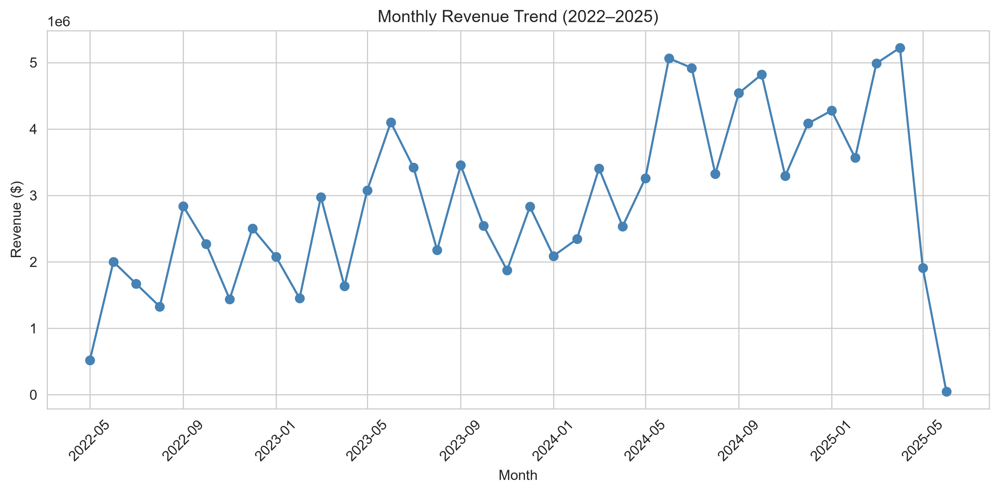
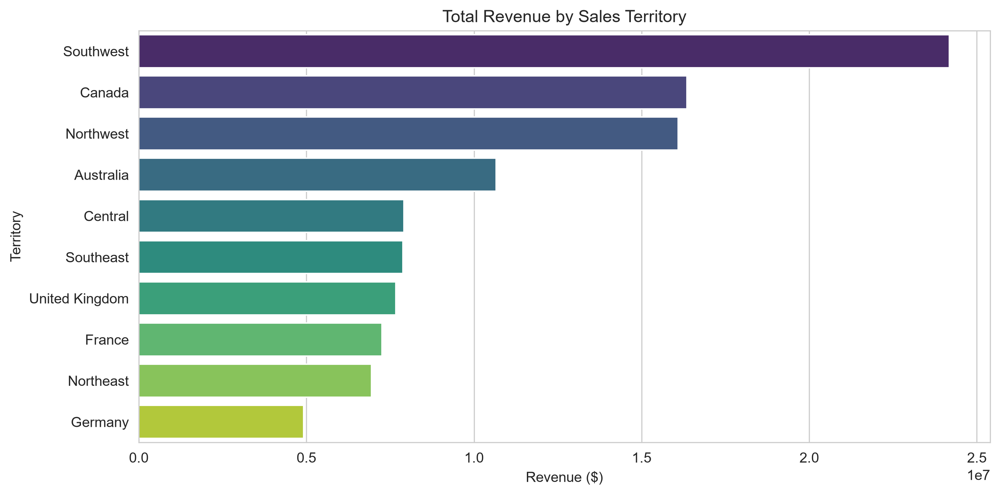
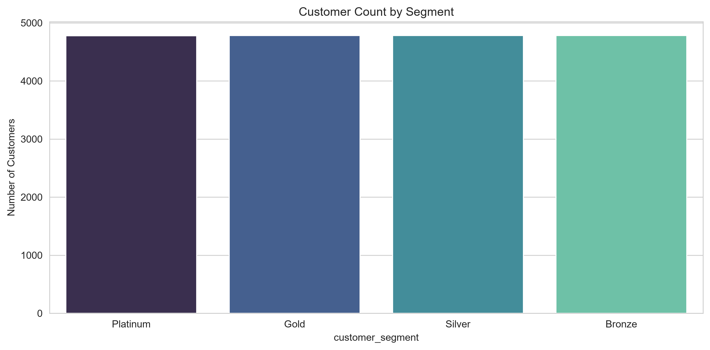
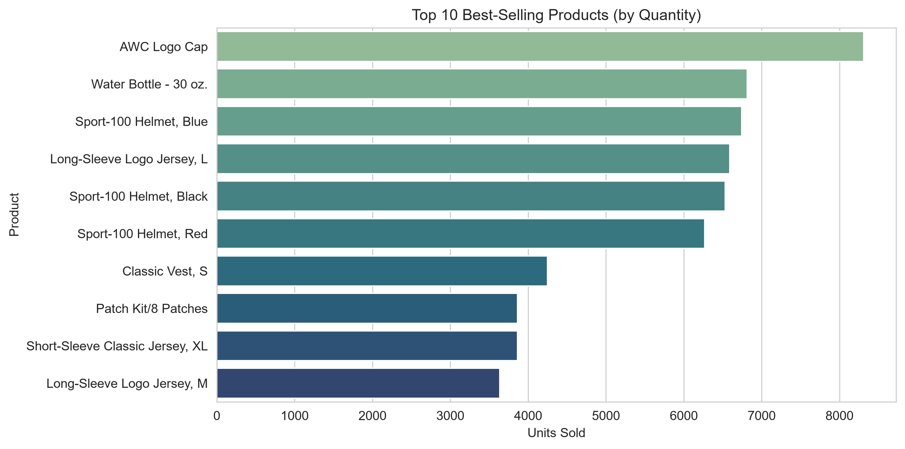
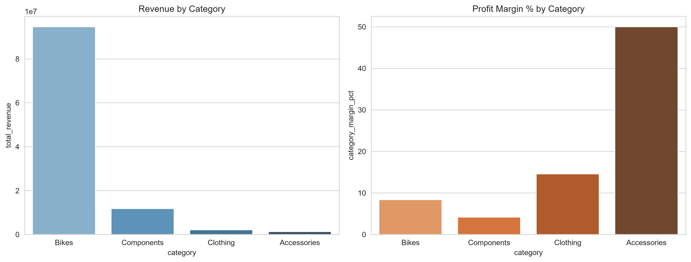
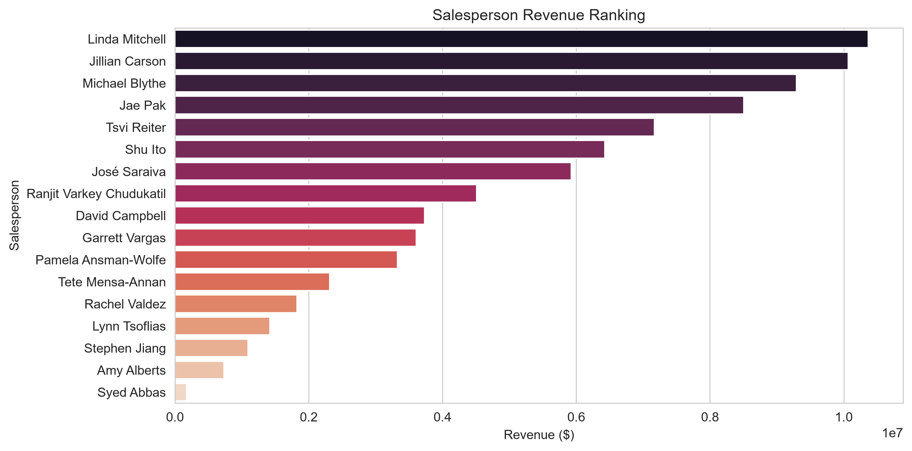
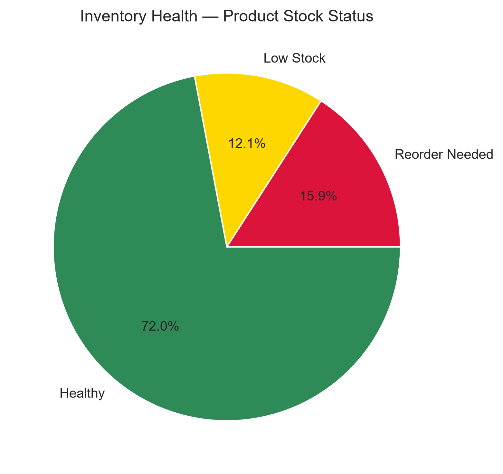

# Enterprise Analytics Hackathon Documentation

## Project Overview
This project was built as an end-to-end analytics engineering solution for the AdventureWorks dataset. The main goal was to move away from repeated ad-hoc SQL queries and create a reusable analytics layer that transforms raw transactional data into business-ready datasets for executive reporting and dashboarding.

The solution includes:
- a chained SQL analytics pipeline
- reusable analytical views and datasets
- a Python notebook for visualization and business analysis
- executive-level recommendations based on the analytical outputs

---

## Business Objective
The database used for this project is optimized for transaction processing, but it is not ideal for business reporting. The task was to design an analytics layer that:
- avoids repeated querying of raw operational tables
- builds reusable intermediate datasets
- supports future dashboards without reworking SQL logic
- provides executive-ready insights for sales, customers, products, employees, territories, inventory, and suppliers

---

## Scope of the Work
The project covered the following business domains:
- Sales
- Customers
- Products
- Employees
- Territories
- Inventory and Purchasing
- Suppliers and Vendor Performance

This work used more than 10 reusable analytical views/tables and produced dashboard-ready KPI datasets for management reporting.

---

## Analytics Architecture
The analytics solution was designed in layers:

1. Raw operational tables
2. Analytics layer views
3. KPI layer views
4. Python notebook visualizations

### Proposed Flow
Raw Tables
↓
Analytics Views
↓
Business Metrics / KPI Views
↓
Python Visualizations and Executive Insights

This architecture ensures that the notebook and future dashboards read from the analytics layer rather than directly from raw tables.

---

## Deliverables Created
The project includes the following files:
- analytics_pipeline.sql — complete SQL pipeline with reusable views and KPI datasets
- executive_analysis.ipynb — notebook for connecting to PostgreSQL, querying analytics views, and generating charts
- README.md — project overview, architecture, design decisions, and summary of findings
- documentation.md — this document summarizing the project work

---

## SQL Pipeline Design
The SQL pipeline was structured into logical stages to make the solution maintainable and reusable.

### Stage 1: Fact and Base Layer
Base analytical fact views were created to simplify downstream reporting.
Examples include:
- sales_order_fact
- sales_line_fact
- purchasing_fact

These views aggregate transactional data into cleaner reusable structures.

### Stage 2: Domain Analytics Layer
Business-specific views were built on top of the fact layer.
Examples include:
- customer_analytics
- customer_segments
- product_analytics
- inventory_analytics
- employee_analytics
- territory_analytics
- vendor_analytics

### Stage 3: KPI / Dashboard Layer
The final layer contains business-ready datasets for dashboards and executive reporting.
Examples include:
- sales_growth_summary
- monthly_revenue
- quarterly_revenue
- best_selling_products
- category_performance
- customer_lifetime_value
- repeat_customers
- customer_retention
- regional_revenue
- inventory_health
- supplier_performance
- purchasing_trends

---

## Advanced SQL Concepts Used
The SQL pipeline demonstrates several analytical SQL techniques:
- Multiple chained CTEs
- Window functions
- CASE WHEN logic
- Conditional aggregation
- Ranking functions such as RANK and NTILE
- Complex joins across different business domains
- Reusable intermediate views for reporting

These features make the SQL more maintainable and suitable for analytics engineering rather than one-off reporting.

---

## Notebook Analysis
The notebook connects to PostgreSQL using pandas and reads data from the analytics and KPI views rather than the raw source tables.

### Visualizations created
The notebook includes charts and analysis for:
- monthly revenue trend
- sales by territory
- customer segments
- top products
- category performance
- employee sales performance
- inventory health
- executive KPI summary

Each chart includes a short business interpretation to support decision-making.

### Chart Insertions
The following charts from the notebook can be pasted into this documentation:

1. Revenue Trend Chart
   - Description: Shows the monthly revenue pattern over time.
   - Business insight: Helps identify growth patterns and seasonal movement.
   - Insert image here:
   

2. Sales by Territory Chart
   - Description: Displays revenue contribution by territory.
   - Business insight: Highlights which regions are performing best and worst.
   - Insert image here:
   

3. Customer Segments Chart
   - Description: Shows customer distribution across segments.
   - Business insight: Reveals the concentration of high-value customers.
   - Insert image here:
   

4. Top Products Chart
   - Description: Displays the best-selling products by quantity.
   - Business insight: Shows which products are most popular with customers.
   - Insert image here:
   

5. Category Performance Chart
   - Description: Compares revenue and margin by product category.
   - Business insight: Highlights where profitability is strongest.
   - Insert image here:
   

6. Salesperson Revenue Ranking Chart
   - Description: Shows revenue contribution by salesperson.
   - Business insight: Identifies top-performing salespeople.
   - Insert image here:
   

7. Inventory Health Chart
   - Description: Shows stock status distribution across products.
   - Business insight: Helps identify inventory risk areas.
   - Insert image here:
   

8. Executive KPI Summary Chart
   - Description: Summarizes key business KPIs in one view.
   - Business insight: Gives leadership a quick snapshot of performance.
   - Insert image here:
   

> If the chart files are saved in a different folder, replace the image paths above with the correct file locations.

---

## Key Business Insights
The analysis revealed several important findings:
- Revenue shows strong overall growth, though the most recent 2025 point is a partial month.
- Bikes contribute the largest share of revenue, but accessories provide better margins.
- Customer segmentation shows that a small group of high-value customers contributes disproportionately to revenue.
- Some regions perform much better than others, indicating opportunity for targeted improvement.
- A notable portion of products need restocking or are running low.
- Supplier reliability is a potential business risk for revenue continuity.

---

## Executive Recommendations
Based on the analysis, the following recommendations were prepared for management:

### Business Opportunities
- Promote accessory bundles with bike purchases to improve profitability
- Build retention programs for repeat and near-repeat customers
- Replicate high-performing territorial strategies in weaker regions
- Focus on high-value customer segments to improve revenue quality
- Strengthen inventory planning for fast-moving products

### Business Risks
- Revenue concentration in the bikes category
- Supplier reliability issues for some vendors
- Inventory risk for products with low stock
- Retention challenges despite customer growth
- Potentially unprofitable acquisition behavior in some customer cohorts

### Actionable Recommendations
- Launch accessory attach-rate initiatives at the point of sale
- Prioritize customer retention campaigns for repeat buyers
- Review supplier performance and risk exposure
- Replenish low-stock products quickly
- Investigate underperforming territories and replicate best practices

---

## Assumptions and Limitations
Some business assumptions were made during the analysis:
- Recency and tenure are measured using the latest date present in the dataset
- Repeat customer logic is based on more than one order
- Supplier ratings are based on reasonable threshold assumptions rather than formal procurement policies
- Inventory stock status uses the data fields already present in the source tables
- The 2025 partial-year data should be interpreted carefully for trend analysis

---

## Summary
This project successfully demonstrates how a transactional database can be transformed into a reusable analytics layer for executive reporting. The final output is a maintainable SQL pipeline and a dashboard-oriented notebook that supports future analytics work without needing to query the raw operational tables directly.
