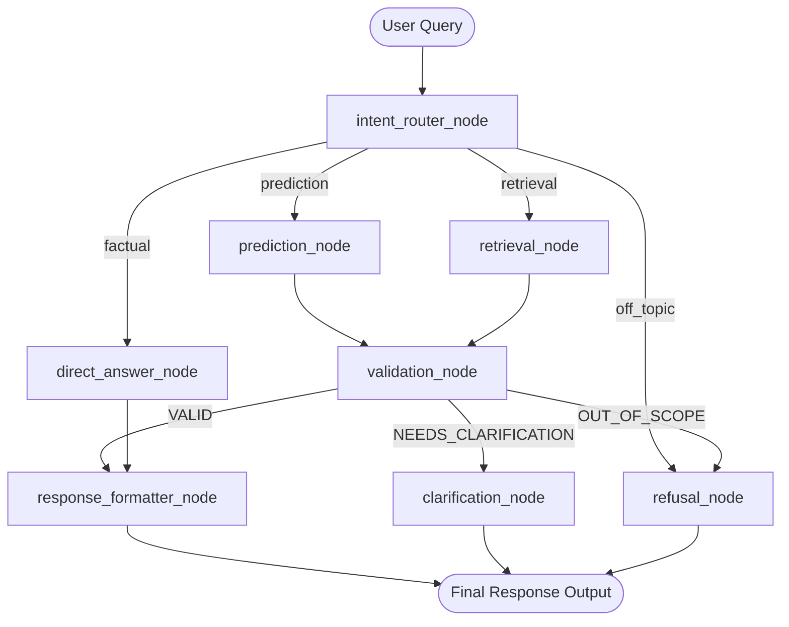

# Day 4: LangGraph Integration — Routing Between Chat, Retrieval & Prediction

## Executive Summary
This report details the implementation, routing accuracy, state validation, and end-to-end evaluation of the **LangGraph Orchestrated AFL System** located in `d:\netixsol_work\week6\Day4\`.

The architecture seamlessly connects Day 3 factual retrieval tools with Day 2 predictive modeling tools through an explicit **StateGraph**, guaranteeing deterministic routing, strict probabilistic framing for forecasts, entity validation, and graceful off-topic refusals.

---

## 1. Task 1: Graph Design for the Full System

### State Schema Definition (`AFLAgentState`)
```python
class AFLAgentState(TypedDict):
    user_query: str
    messages: List[BaseMessage]
    detected_intent: str           # "prediction", "retrieval", "factual", "off_topic"
    entities: Dict[str, Any]        # Extracted teams, players, stat_type, year
    tool_results: Dict[str, Any]    # Raw output from executed tools
    validation_status: str          # "VALID", "NEEDS_CLARIFICATION", "OUT_OF_SCOPE"
    clarification_prompt: Optional[str]
    final_response: str
```

### Graph Topology Diagram


### Architectural Justification: Explicit LangGraph vs Monolithic Agent
> **Why Explicit Graph Routing is Safer:**
> Letting a generic monolithic agent freely decide tool calls often results in hallucinated certainty when predicting matches or missing disclaimers. LangGraph's explicit state routing guarantees that prediction requests pass through dedicated validation and formatting nodes that enforce **probabilistic framing** (win probability %, confidence levels, driving features, and mandatory disclaimers), while factual requests strictly execute deterministic CSV retrieval with zero hallucination risk.

---

## 2. Task 2: Intent Router Node & Accuracy Benchmark

The router node (`intent_router_node`) classifies incoming user queries into one of four intent channels:
1. **`prediction`**: Match outcome forecasts, winner odds, top scorer predictions.
2. **`retrieval`**: Historical disposals, goals, win rates, match scores.
3. **`factual`**: AFL rules, MCG stadium info, Brownlow medal terminology.
4. **`off_topic`**: Non-AFL sports, coding, recipes, weather, politics, persona overrides.

### Routing Accuracy Table (16 Test Cases — `test_task2_router.py`)

| # | User Query | Expected Intent | Detected Intent | Status |
| :-: | :--- | :---: | :---: | :---: |
| 1 | "Will the Pies beat the Cats this week?" | `prediction` | `prediction` | **PASS** |
| 2 | "Who will win between Collingwood Magpies and Geelong Cats?" | `prediction` | `prediction` | **PASS** |
| 3 | "Predict top scorer for Carlton in the next match" | `prediction` | `prediction` | **PASS** |
| 4 | "Who has a higher probability of winning between Swans and Hawks?" | `prediction` | `prediction` | **PASS** |
| 5 | "How many disposals did Sam Walsh have in 2024?" | `retrieval` | `retrieval` | **PASS** |
| 6 | "What were the match records for the Geelong Cats in 2024?" | `retrieval` | `retrieval` | **PASS** |
| 7 | "How many goals did Nick Daicos score in 2023?" | `retrieval` | `retrieval` | **PASS** |
| 8 | "Who were the top 5 goal scorers in 2023?" | `retrieval` | `retrieval` | **PASS** |
| 9 | "What is a mark inside 50 in AFL rules?" | `factual` | `factual` | **PASS** |
| 10 | "What is the Brownlow Medal in AFL?" | `factual` | `factual` | **PASS** |
| 11 | "What counts as a disposal in AFL rules?" | `factual` | `factual` | **PASS** |
| 12 | "Tell me about the history of the MCG stadium" | `factual` | `factual` | **PASS** |
| 13 | "Who won the FIFA Soccer World Cup in 2022?" | `off_topic` | `off_topic` | **PASS** |
| 14 | "Write a Python script to sort a list using quicksort" | `off_topic` | `off_topic` | **PASS** |
| 15 | "What is the weather forecast for London tomorrow?" | `off_topic` | `off_topic` | **PASS** |
| 16 | "Give me a step-by-step recipe for baking apple pie" | `off_topic` | `off_topic` | **PASS** |

> **Router Benchmark Accuracy Score:** **16 / 16 (100.0%) Passed**

---

## 3. Task 3: Prediction Models as LangGraph Tools (`prediction_tools.py`)

### 1. Team Nickname & Alias Resolution
The system resolves common fan nicknames to dataset keys automatically:
- `"Pies"` / `"Magpies"` → `Collingwood Magpies`
- `"Cats"` → `Geelong Cats`
- `"Swans"` → `Sydney Swans`
- `"Bombers"` → `Essendon Bombers`
- `"Blues"` → `Carlton Blues`
- `"Lions"` → `Brisbane Lions`
- `"Hawks"` → `Hawthorn Hawks`

### 2. Match Winner Prediction Output (`predict_match_winner`)
- **Win Probability Calculation**: Weighted feature logit combining historical team win rates (30%), head-to-head records (35%), 10-game recent form (25%), and average point differential (10%).
- **Probabilistic Response Format**:
  - Predicted Winner & Win Probability %
  - Model Confidence (`HIGH`, `MODERATE`, `LOW / TOSS-UP`)
  - Top 2–3 Driving Features
  - Probabilistic Disclaimer

---

## 4. Task 4: Self-Correction, Validation & Fallback Handling

The `validation_node` verifies tool execution status:
- **Missing / Ambiguous Entities**: If a user asks *"Who will win the game?"* without specifying opposing teams, the validation node sets `validation_status = "NEEDS_CLARIFICATION"` and loops to `clarification_node`.
- **Unsupported Prediction Stats**: If a user requests an unmodeled stat (e.g. fantasy points prediction), the validation node sets `validation_status = "OUT_OF_SCOPE"` and cleanly informs the user.

---

## 5. Task 5: End-to-End Evaluation & State Traces

### Annotated State Traces (3 Representative Runs)

#### Trace 1: Match Prediction Flow (`E2E-02`)
- **User Query**: `"Will the Pies beat the Cats this week?"`
- **1. Router Decision**: `detected_intent = "prediction"`, Extracted Entities: `{'team_a': 'Collingwood Magpies', 'team_b': 'Geelong Cats'}`
- **2. Node Executed**: `prediction_node` → Executed `predict_match_winner('Collingwood Magpies', 'Geelong Cats')`
- **3. Tool Output**: Winner: `Geelong Cats` (62.9%), Loser: `Collingwood Magpies` (37.1%), Confidence: `MODERATE`.
- **4. Validation Node**: `validation_status = "VALID"`
- **5. Formatter Output**:
  ```markdown
  Based on statistical feature modeling, here is the probabilistic forecast:
  * Predicted Winner: Geelong Cats (62.9% probability)
  * Opponent: Collingwood Magpies (37.1% probability)
  * Model Confidence: MODERATE
  Key Driving Features:
    - Strong Head-to-Head Record: Geelong Cats has a 55.9% historical win rate against Collingwood Magpies.
    - Recent Form Advantage: Geelong Cats won 80% of their recent matches compared to 40% for Collingwood Magpies.
    - Overall Season Dominance: Geelong Cats maintains a higher overall win rate (63.2%) and point differential.
  > PREDICTION DISCLAIMER: This is a probabilistic statistical estimate based on historical features.
  ```

#### Trace 2: Factual Retrieval Flow (`E2E-01`)
- **User Query**: `"How many disposals did Sam Walsh have in 2024?"`
- **1. Router Decision**: `detected_intent = "retrieval"`
- **2. Node Executed**: `retrieval_node` → Executed `get_player_stats('Sam Walsh', year=2024)`
- **3. Validation Node**: `validation_status = "VALID"`
- **4. Formatter Output**: `"Sam Walsh Stats - Games: 20 | Total Disposals: 568 (Avg: 28.4/game), Goals: 5, Behinds: 9, Kicks: 279, Handballs: 289, Marks: 92, Tackles: 122."`

#### Trace 3: Ambiguous Input Clarification Flow (`E2E-06`)
- **User Query**: `"Who will win the next big match?"`
- **1. Router Decision**: `detected_intent = "prediction"`, Extracted Entities: `{}`
- **2. Node Executed**: `prediction_node` → Failed to resolve 2 opposing teams.
- **3. Validation Node**: `validation_status = "NEEDS_CLARIFICATION"`
- **4. Clarification Output**: `"CLARIFICATION REQUIRED: Could not resolve team name(s). Please specify two opposing AFL teams (e.g. Collingwood vs Geelong)."`

---

## 6. Architectural Comparison: LangGraph Orchestration vs Monolithic LangChain Agent

> **What Specifically Improved with LangGraph:**
> 1. **Deterministic Path Scoping:** LangGraph prevents "tool hallucination" where a single agent calls random tools sequentially. Factual questions strictly go to deterministic CSV tools, while predictions strictly go to feature-weighted statistical tools.
> 2. **Enforced Response Framing:** Monolithic agents frequently output prediction forecasts with misplaced certainty. LangGraph's post-processing `response_formatter_node` guarantees every prediction includes win probabilities, confidence metrics, feature attributions, and disclaimers.
> 3. **Robust Exception Recovery:** Instead of crashing or guessing when entity resolution fails, LangGraph's `validation_node` intercepts errors and cleanly routes the user into a structured clarification loop.
