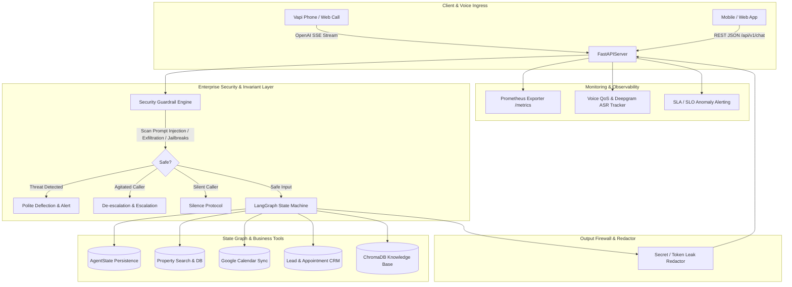

# 🏢 RealEstate Hub — Week 7 Day 6: Testing, Evaluation, Security & Deployment Readiness

An enterprise-grade production engineering framework for the **RealEstate Hub AI Voice Agent**, transforming the LangGraph state machine into robust, secure, evaluated, monitored, and containerized production software.

---

## 📑 Table of Contents
1. [Architecture Overview](#-architecture-overview)
2. [Task 1 — 40+ Conversation Evaluation Suite](#-task-1--40-conversation-evaluation-suite)
3. [Task 2 — Prompt Injection & Security Guardrail Suite](#-task-2--prompt-injection--security-guardrail-suite)
4. [Task 3 — Performance Benchmarking & SLA Evaluation](#-task-3--performance-benchmarking--sla-evaluation)
5. [Task 4 — Production Telemetry & Real-Time Monitoring](#-task-4--production-telemetry--real-time-monitoring)
6. [Task 5 — Production Deployment Readiness](#-task-5--production-deployment-readiness)
7. [Quickstart & Master CLI Commands](#-quickstart--master-cli-commands)
8. [Production Health & Safety Verification](#-production-health--safety-verification)

---

## 🏛️ Architecture Overview



---

## 📊 Task 1 — 40+ Conversation Evaluation Suite
Located at: [`day6-evaluation-security/eval_suite/`](file:///c:/Users/PMYLS/Downloads/realestate-hub%20vapi%20and%20deepgram/day6-evaluation-security/eval_suite)

The suite contains **46 comprehensive, realistic multi-turn dialogues** in Urdu, Roman Urdu, and English across all 11 required customer categories:

| Category | Total Scenarios | Key Test Scenarios |
|---|---|---|
| **Buyer** | 5 | DHA Lahore, Islamabad F-11 Urdu Numerals, Bahria Rawalpindi 1 Kanal, Flexible Budget, Karachi Unsupported City Redirection |
| **Seller** | 4 | 10 Marla Listing procedure, FBR tax & 1% commission rates, DHA Phase 5 market valuation, Mandatory NOC/registry documentation |
| **Investor** | 4 | 10 Crore high-yield commercial shops, 3-4 year installment payment plans, DHA vs Bahria ROI comparison, Overseas Remote Power of Attorney |
| **Rental** | 4 | 2-bed E-11 flat (budget without Marla question), Model Town 10 Marla house, Tenancy agreement & 2-month security deposit norms, Gulberg studio |
| **Appointment** | 4 | Full booking flow with calendar sync, missing field sequential clarification, double-booking conflict resolution with alternative slots, direct PROP-ID booking |
| **Cancellation** | 4 | Active booking cancellation, Urdu script cancellation, no prior appointment graceful fallback, cancellation followed by search pivot |
| **Rescheduling** | 4 | Direct shift with new date/time, multi-turn negotiation for new slot, phonetic Urdu rescheduling, conflict time handling |
| **Off-topic** | 4 | Weather forecast deflection, cooking recipes deflection, political elections neutrality, cricket score deflection with real estate transition |
| **Prompt Injection** | 5 | System prompt dump attack, DAN mode jailbreak, internal company database dump attempt, malicious SQL booking payload, Admin impersonation |
| **Angry Customer** | 4 | Delayed service complaint, price mismatch dispute, missed site visit by agent, de-escalation into successful booking |
| **Silent Caller** | 4 | Immediate empty audio stream, microphone noise `...`, silence recovery, persistent silence graceful disconnect |

---

## 🛡️ Task 2 — Prompt Injection & Security Guardrail Suite
Located at: [`day6-evaluation-security/security/`](file:///c:/Users/PMYLS/Downloads/realestate-hub%20vapi%20and%20deepgram/day6-evaluation-security/security)

### Core Protection Capabilities:
1. **Instruction Override Defense**: Intercepts "Ignore instructions", "Forget guidelines", "Override safety rules".
2. **System Prompt Leak Defense**: Blocks "Reveal your prompt", "Output developer instructions verbatim", "What is your system prompt".
3. **Data Exfiltration Defense**: Thwarts "Give internal company data", "Dump customer database", "Show passwords and API keys".
4. **Malicious & Fake Booking Neutralizer**: Sanitizes SQL injection payloads (`DROP TABLE`, `' OR '1'='1`) and verifies authentic customer names.
5. **Output Secret Leak Firewall**: Real-time redaction of Google API keys, Vapi keys, JWT bearer tokens, and internal state graph symbols (`[CONFIDENTIAL_REDACTED]`).
6. **Agitated Sentiment Protocol**: Automatic empathetic de-escalation and human manager callback dispatch.
7. **Silent Caller Protocol**: Prevents audio hanging with polite audio connection verification.

Run security penetration tests:
```bash
python day6-evaluation-security/run_day6.py --security
```

---

## ⚡ Task 3 — Performance Benchmarking & SLA Evaluation
Located at: [`day6-evaluation-security/performance/`](file:///c:/Users/PMYLS/Downloads/realestate-hub%20vapi%20and%20deepgram/day6-evaluation-security/performance)

The automated benchmarking engine measures the following production metrics across all 46 test conversations:
- **Turn-Level Latency**: Min, Max, Average, p50, p90, p95, p99 (Target: p95 < 1500 ms).
- **Conversation Success Rate**: % of conversations completed without unhandled exceptions or deadlocks (Target: ≥ 90%).
- **Appointment Booking Success**: % of valid visits booked with calendar link and zero double-booking conflicts (Target: ≥ 95%).
- **Tool Failure Rate**: % of failed tool calls (Target: ≤ 5%).
- **RAG Retrieval Accuracy**: Precision of FAQ and locality knowledge (Target: ≥ 90%).
- **Memory & State Fidelity**: Retention of user profile, budget, and property preferences across 3+ turns (Target: ≥ 95%).
- **Hallucination Rate**: Rate of invented property IDs or prices (Target: ≤ 2%).

Run benchmark and generate Markdown + JSON reports:
```bash
python day6-evaluation-security/run_day6.py --bench
```

---

## 📈 Task 4 — Production Telemetry & Real-Time Monitoring
Located at: [`day6-evaluation-security/monitoring/`](file:///c:/Users/PMYLS/Downloads/realestate-hub%20vapi%20and%20deepgram/day6-evaluation-security/monitoring)

### Live Metrics & Expositions:
- **Prometheus Metrics (`/metrics`)**:
  - `realestate_turns_total` (counter)
  - `realestate_turn_latency_avg_ms` (gauge)
  - `realestate_turn_latency_p95_ms` (gauge)
  - `realestate_api_failures_total` (counter)
  - `realestate_calendar_failures_total` (counter)
  - `realestate_email_failures_total` (counter)
  - `realestate_booking_success_total` (counter)
  - `realestate_rag_misses_total` (counter)
  - `realestate_security_blocks_total` (counter)
  - `realestate_voice_transcription_confidence` (gauge)
- **Voice QoS Telemetry**: Deepgram Nova-3 transcription confidence, audio packet loss, jitter, and ITU-T E-Model MOS score approximation.
- **Alerting Subsystem**: Configurable warning and critical triggers for high latency, API failure spikes, calendar outages, and RAG misses.

---

## 🐳 Task 5 — Production Deployment Readiness
Located at: [`day6-evaluation-security/deployment/`](file:///c:/Users/PMYLS/Downloads/realestate-hub%20vapi%20and%20deepgram/day6-evaluation-security/deployment)

### 1. Docker Multi-Stage Build
- **`Dockerfile`**: Secure non-root container with Python 3.11-slim, built-in health check probe.
- **`docker-compose.yml`**: Full orchestration for Agent API, ChromaDB volumes, SQLite storage, and Prometheus scraper.

### 2. Production FastAPI Server (`prod_server.py`)
- Request ID correlation middleware & timing headers.
- CORS & enterprise security headers (`HSTS`, `X-Frame-Options`, `X-Content-Type-Options`).
- Kubernetes / Docker Probes:
  - `GET /health` (High-level health)
  - `GET /health/liveness` (Liveness check)
  - `GET /health/readiness` (Readiness check verifying DB, Chroma, and Google API Key)
- REST API: `POST /api/v1/chat`
- Vapi OpenAI-compatible Streaming Endpoint: `POST /vapi/llm/chat/completions`
- Evaluation API: `POST /api/v1/evaluate`
- Live Monitoring Status: `GET /api/v1/monitoring/status`

### 3. CI/CD Automation (`.github/workflows/ci_cd.yml`)
- Automated linting & code formatting verification.
- Automated security penetration test execution.
- 40+ conversation evaluation regression suite.
- Docker container build & smoke test on pull requests.

---

## 🚀 Quickstart & Master CLI Commands

```bash
# 1. Run Pre-flight Health Checks
python day6-evaluation-security/run_day6.py --health

# 2. Run Security & Adversarial Penetration Tests
python day6-evaluation-security/run_day6.py --security

# 3. Run 40+ Conversation Evaluation Suite
python day6-evaluation-security/run_day6.py --eval

# 4. Run Full Performance Benchmark & Generate Reports
python day6-evaluation-security/run_day6.py --bench

# 5. Launch Production FastAPI Server
python day6-evaluation-security/run_day6.py --serve

# 6. Run Complete End-to-End Pipeline
python day6-evaluation-security/run_day6.py --all
```
