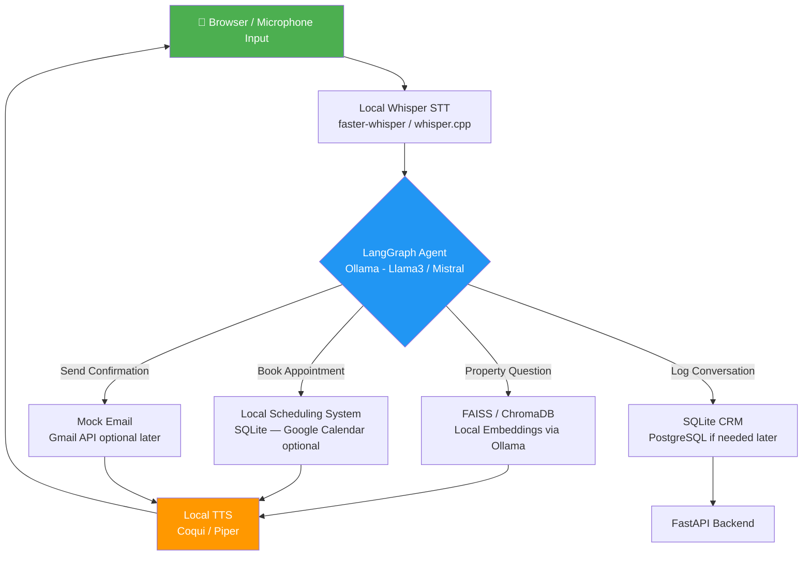

# Task 1 — Voice Agent Architecture

## How It Works (End to End)

```
Caller (Browser/Mic) → Whisper STT → LangGraph Agent (Ollama LLM) → Tools/RAG → Local TTS → Audio Output
                                              ↓
                                   FAISS/Chroma  |  SQLite  |  Local Calendar  |  Mock Email
```

**Every call follows this pipeline:**

1. **Telephony (Local Demo)** — Voice input from browser microphone. Real phone integration added later via Twilio or SIP.
2. **STT** — Local Whisper (`whisper.cpp` or `faster-whisper`) transcribes speech offline, no API cost.
3. **LLM** — Ollama runs a local open-source model (Llama 3.2 / Mistral / Qwen2.5). No OpenAI credits needed.
4. **Agent** — LangGraph orchestrates multi-step reasoning: understand intent → call tools → generate response.
5. **RAG** — Local embedding model (nomic-embed-text via Ollama) + FAISS/Chroma stores property listings and FAQs. All runs offline.
6. **Tools** — SQLite database for structured CRM data. Local scheduling system for appointments (Google Calendar added optionally later). Mock email initially, Gmail API added later if credentials are available.
7. **TTS** — Local TTS engine (Coqui TTS or Piper) converts response to audio. ElevenLabs free tier used only for demo comparison.
8. **Memory** — Conversation state stored per session in LangGraph state. Persisted to SQLite for returning customers.

---

## Architecture Diagram



---

## Technology Stack

| Layer | Tool | Notes |
|---|---|---|
| **LLM** | Ollama (Llama 3.2 / Mistral / Qwen2.5) | Fully local, no API cost |
| **Agent Framework** | LangGraph + LangChain | Stateful workflows, tool calling |
| **Embeddings** | nomic-embed-text via Ollama | Local, no API needed |
| **Vector DB** | FAISS → ChromaDB | FAISS for speed, Chroma for persistence |
| **Structured DB** | SQLite → PostgreSQL | SQLite to start, scale later |
| **STT** | faster-whisper (local) | Offline transcription, fast |
| **TTS** | Coqui TTS / Piper (local) | ElevenLabs free tier for demo comparison only |
| **Backend** | FastAPI | Async, WebSocket for streaming |
| **Email** | Mock (print/log) → Gmail API | Free Gmail credentials added when available |
| **Calendar** | Local SQLite scheduler → Google Calendar | Optional GCal integration later |
| **Telephony** | Browser mic (local demo) → Twilio/SIP | Real phone integration added in later phase |
| **Deployment** | Local initially → Docker → Railway/Render | Progressive deployment |

---

## Progressive Build Strategy

```
Phase 1 (This Week): 100% local — Whisper + Ollama + FAISS + SQLite + local TTS + browser mic
Phase 2 (Optional):  Add Gmail API, Google Calendar, ElevenLabs demo comparison
Phase 3 (Production): Add Twilio telephony, PostgreSQL, Docker, cloud deploy
```

This keeps Day 1–5 completely free to run with zero API costs.
