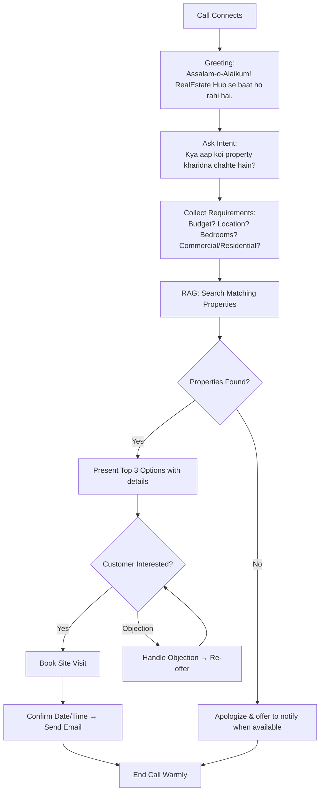
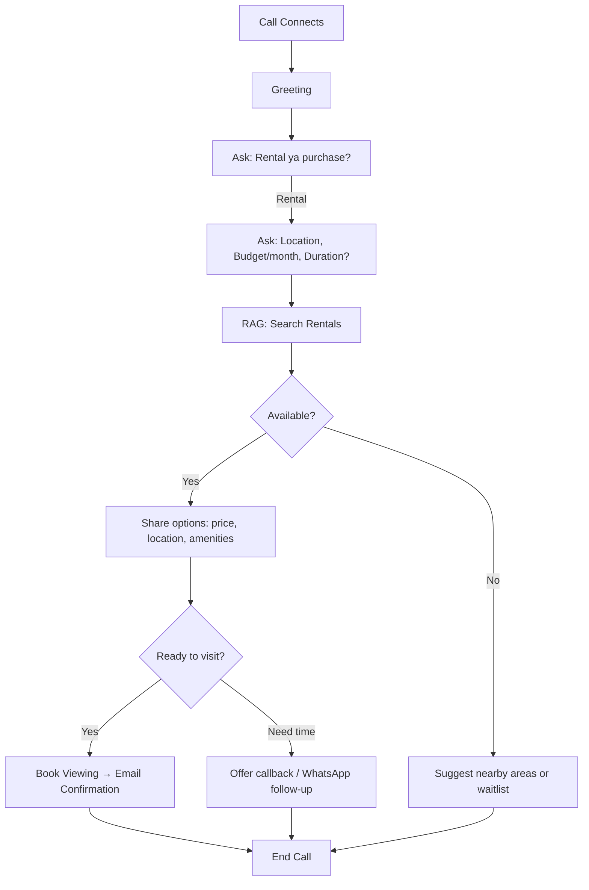
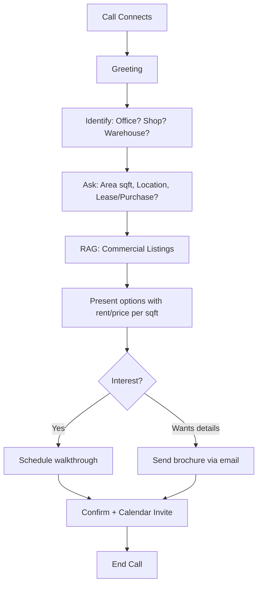
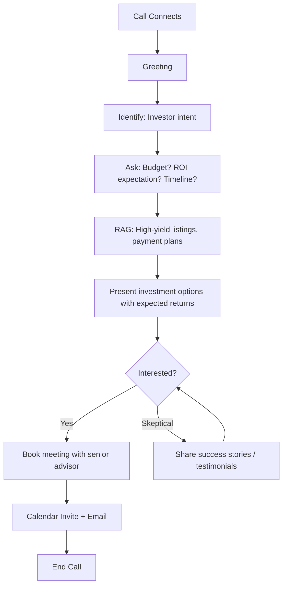
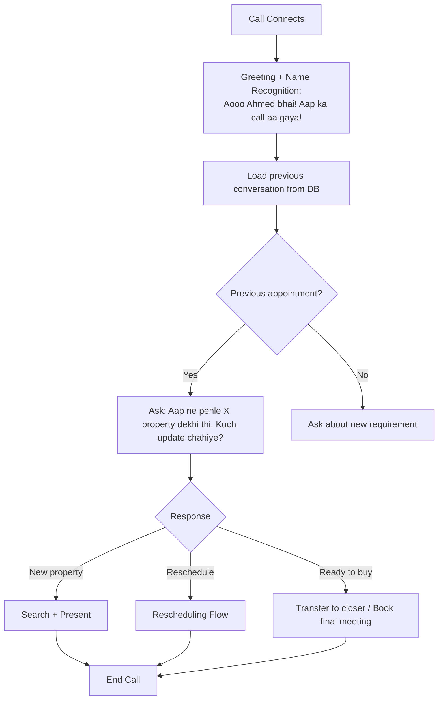
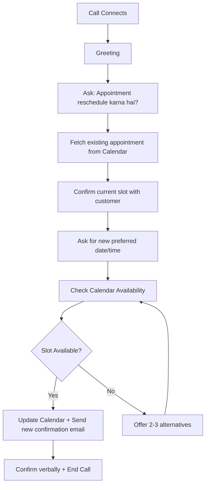
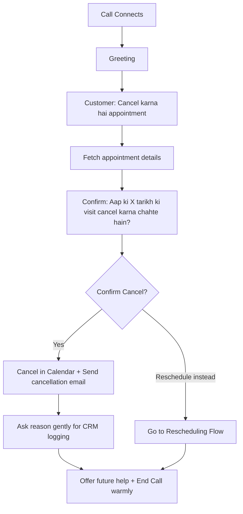

# Task 2 — Conversation Flow Designs

---

## Flow 1: Buyer Inquiry

---

## Flow 2: Rental Inquiry

---

## Flow 3: Commercial Property Inquiry

---

## Flow 4: Investment Inquiry

---

## Flow 5: Returning Customer

---

## Flow 6: Appointment Rescheduling

---

## Flow 7: Appointment Cancellation

